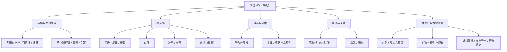
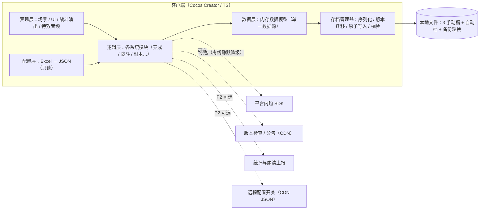
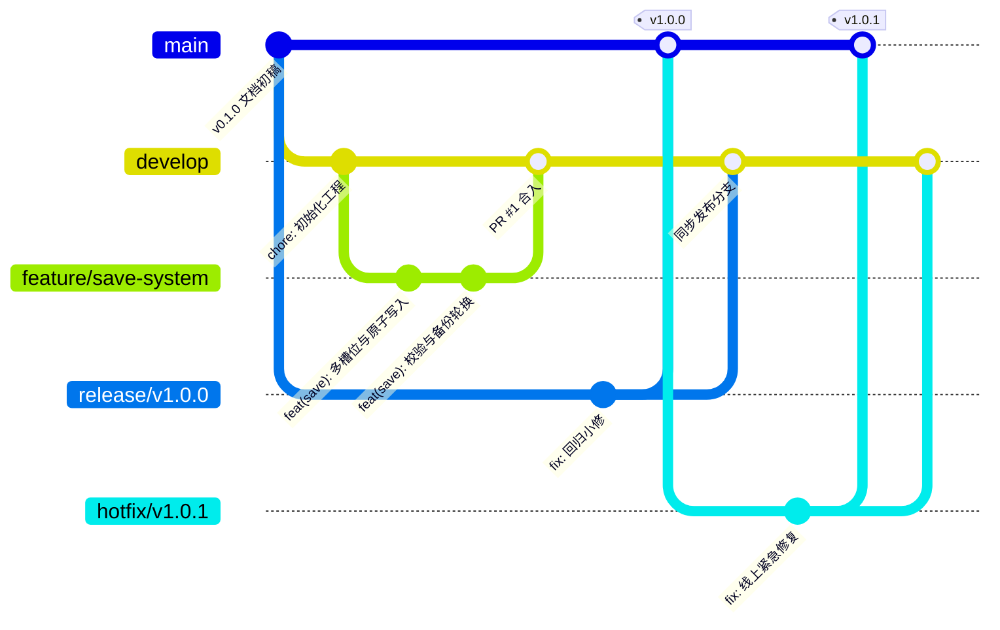

# 《神仙道》高清重制版手游 — 开发文档（单机版）

> **项目代号**：仙途 HD（暂定名，正式名称需商标检索后另行确定）  
> **文档版本**：v0.2.1 ｜ **更新日期**：2026-09-04  
> **开发负责人**：dsh ｜ **产品负责人**：项目所有者  
> **管理方式**：本文档纳入 Git 管理，修订须提交并写明原因（见 §5.3 提交规范）

---

## 文档修订记录

| 版本     | 日期         | 修订人 | 说明                                             |
| ------ | ---------- | --- | ---------------------------------------------- |
| v0.2.1 | 2026-09-04 | —   | 补记远程仓库地址：§5.1 / §5.7 占位改为 `rootgrac/sxdproject.git` |
| v0.2.0 | 2026-09-04 | —   | **改为单机离线方案**：移除服务端与联网社交，重写技术方案（本地存档）、开发计划与回滚预案 |
| v0.1.0 | 2026-09-04 | —   | 初稿：项目概述 / 功能清单 / 技术方案 / 开发计划 / Git 规范          |

## 目录

1. [给 dsh 的执行说明](#0-给-dsh-的执行说明)
2. [项目概述](#1-项目概述)
3. [功能清单与开发优先级](#2-功能清单与开发优先级)
4. [技术方案](#3-技术方案)
5. [开发计划](#4-开发计划)
6. [Git 规范（版本可追溯与可回滚）](#5-git-规范版本可追溯与可回滚)
7. [附录](#6-附录)

---

## 0. 给 dsh 的执行说明

**阅读顺序**：第一天先读 §1.3 合规红线 与 §5 Git 规范（当天就要照做），再按 §4 阶段推进；功能细节查 §2，技术细节查 §3。

**第一周任务清单**：

- [ ] 安装开发环境（附录 B）
- [ ] 按附录 A 初始化仓库结构，推送产品负责人提供的 GitHub 仓库
- [ ] 跑通 Cocos Creator 空项目 → 真机预览
- [ ] 实现存档系统最小闭环：创建 / 写入 / 读取 / 校验 / 备份轮换（§3.5）
- [ ] 用占位美术完成一场 3v3 回合制战斗原型（§3.4）

**工作节奏**：每周五提交周报（完成项 / 风险 / 下周计划，写进 GitHub Issue）；每两周校准一次工期估算；任何对本文档的偏离（方案、工期、优先级），先提 Issue 说明并经产品负责人确认，再更新文档。

---

## 1. 项目概述

### 1.1 项目定位

| 维度   | 定义                                                 |
| ---- | -------------------------------------------------- |
| 类型   | 横版回合制仙侠 RPG（**单机、离线可玩**）                           |
| 版本定位 | **高清重制版**：保留原版核心玩法框架，全面升级美术表现与工程能力，做成一款"现代化的单机仙侠"  |
| 参照对象 | 《神仙道》（手游版）的**玩法机制层**，仅机制参照，详见 §1.2 / §1.3          |
| 目标平台 | Android / iOS 优先；微信小游戏为可选扩展（P2，单机玩法天然适配）           |
| 目标用户 | 25-40 岁仙侠题材爱好者、原作怀旧玩家、养成挂机类玩家                      |
| 商业模式 | 免费下载 + 内购（去广告 / 解锁完整内容 / 可选礼包），**无强制联网验证**，遵循各平台政策 |
| 团队   | 开发 1 人（dsh，客户端），美术外包，产品兼测试 1 人                     |

**"高清重制"的量化定义**：

- 设计分辨率 1920×1080，全套 UI 按 2x 出图，适配刘海屏与平板
- 角色采用 Spine 骨骼动画，替换逐帧小图
- 战斗加入镜头推拉、技能粒子特效、伤害飘字动效
- 全界面分辨率自适应

**"单机化"的改造原则**：一切原本依赖服务器的玩法（竞技排名、社交、邮件补偿）改为本地实现或删除；存档系统按"玩家数据资产"标准对待（可靠、可迁移、可备份），可靠性要求等同原方案的服务端。

### 1.2 玩法参照范围（机制白名单）

只参照"机制"，不参照任何具体表达（名称、文案、美术、数值）：

| 保留机制                  | 高清重制方向                          |
| --------------------- | ------------------------------- |
| 3×3 九宫格回合制战斗、气势条与绝技释放 | 确定性战斗内核 + 回放 + 战斗演出增强           |
| 境界突破 + 三围（武力/绝技/法术）成长 | 保留框架，境界名称与数值全部重新设计              |
| 伙伴招募 / 养成 / 传承        | 保留框架，原创伙伴角色与技能设计                |
| 装备强化 / 打造 / 宝石镶嵌      | 保留框架，体验与 UI 现代化                 |
| 猎命类运气玩法               | 机制保留，包装原创化（观星 / 星命）             |
| 主线 / 精英 / 爬塔副本        | 关卡、掉落、文案全原创                     |
| 竞技场排名挑战               | 改为**挑战 AI 名将镜像阵容**（本地实现，无实时对战）  |
| 系统邮件 / 运营奖励           | 改为本地系统信箱，发放补偿与奖励                |
| 好友 / 帮派 / 聊天          | **移除**（联网社交），以成就与图鉴等收集向系统补位留存目标 |

### 1.3 知识产权与合规红线（所有成员必读）

1. **美术 100% 原创**：角色、场景、UI、图标、特效、音效、音乐一律原创，或使用可商用授权素材并保留授权凭证（存 `tools/art-licenses/`）。禁止临摹原版、抠图、解包提取资源。
2. **文案与命名原创**：不使用原版角色名、技能名、境界名、宣传语。**上线名称不得含「神仙道」字样**（商标风险），发布前完成商标检索；内部代号仅限文档使用。
3. **代码自研**：禁止反编译 / 解包原版客户端；使用第三方开源代码必须遵守其 License 并登记。
4. **数值独立设计**：只参照机制框架，数值表从零设计并经战斗模拟器调优验证（§3.6）。
5. **上架合规**：国内渠道商业化上架（含单机）需软著 + 版号（需公司主体），流程长，M0 即启动；海外区（App Store / Google Play）可先行发布；实名认证与防沉迷按渠道要求接入。
6. **隐私合规**：若接入统计 / 崩溃上报，需隐私政策与用户同意（欧盟含 GDPR），默认离线不采集。
7. 违反红线的产出**不得进入仓库**；发现即删除并记录到 `docs/incidents.md`。

### 1.4 目标平台与性能指标

| 指标    | 目标                                                |
| ----- | ------------------------------------------------- |
| 离线能力  | **100% 离线可玩**；版本检查 / 内购 / 可选统计等在线能力全部可失败、静默降级     |
| 最低适配  | Android 7.0（骁龙 660 级别）；iPhone 8                   |
| 帧率    | 最低机型战斗场景 ≥ 30fps；主流机型 60fps                       |
| 首包    | Android ≤ 200MB；iOS ≤ 300MB                       |
| 更新方式  | 整包更新（应用商店）；Android 资源热更为 P2 可选（iOS 不做代码热更，规避审核风险） |
| 存档可靠性 | 杀进程 / 断电 / 升级版本不丢档；存档损坏自动回退备份                     |
| 稳定性   | 崩溃率 < 0.5%                                        |

---

## 2. 功能清单与开发优先级

**优先级定义**：

- **P0**：MVP 必须，核心闭环缺它不可
- **P1**：上线必备
- **P2**：上线后迭代

**规模估算**（按 1 名全职开发）：S ≤ 2 人日；M = 3~~5 人日；L = 1~~2 人周；XL > 2 人周。均为毛估，每两周校准。

### 2.0 功能全景图




### 2.1 功能明细

#### S1 存档与基础框架【批次 1】

| 功能点     | 说明                                    | 优先级 | 规模 |
| ------- | ------------------------------------- | --- | -- |
| 多槽位存档   | 3 个手动槽 + 1 个自动档；创建 / 删除 / 复制 / 覆盖确认   | P0  | M  |
| 存档可靠性   | 原子写入、SHA-256 校验、备份轮换（保留最近 2 份）、损坏自动回退 | P0  | M  |
| 存档迁移    | saveVersion 版本号 + 迁移函数链，版本升级不丢档       | P0  | M  |
| 客户端框架   | UI 面板栈、事件总线、资源管理（引用计数）、音频管理、弹窗队列      | P0  | L  |
| 导表工具    | Excel → JSON，游戏内统一读取                  | P0  | M  |
| 系统设置    | 音频 / 画质 / 战斗速度默认值 / 语言                | P0  | S  |
| 版本检查与公告 | 在线可选，离线静默跳过                           | P2  | S  |

#### S2 角色养成【批次 1】

| 功能点   | 说明                     | 优先级 | 规模 |
| ----- | ---------------------- | --- | -- |
| 等级与经验 | 战斗 / 任务产出，升级解锁功能       | P0  | S  |
| 境界突破  | 通脉→凝元→…（原创命名），解锁上阵位与玩法 | P0  | M  |
| 根骨三围  | 武力 / 绝技 / 法术成长，决定战斗属性  | P0  | M  |
| 战力计算  | 统一战力公式，用于展示与成就         | P0  | S  |

#### S3 核心战斗【批次 1】

| 功能点    | 说明                                   | 优先级 | 规模 |
| ------ | ------------------------------------ | --- | -- |
| 布阵编辑   | 3×3 九宫格拖拽换位，站位加成                     | P0  | M  |
| 回合制内核  | 速度排序行动、普攻 / 绝技、气势积攒、胜负判定（确定性 + 种子回放） | P0  | XL |
| 技能与效果器 | 配置表驱动：伤害段 / 治疗 / 增减益 / 召唤            | P0  | L  |
| 战斗表现   | 动画衔接、飘字、震屏、粒子、2x/3x 加速与跳过            | P0  | L  |
| 回放与自校验 | 回放结果一致性校验、关键数值越界检测（单机弱对抗）            | P1  | M  |

#### S4 伙伴系统【批次 2】

| 功能点  | 说明                          | 优先级 | 规模 |
| ---- | --------------------------- | --- | -- |
| 招募   | 声望门槛 + 招募玩法（单抽 / 十连，保底规则原创） | P0  | M  |
| 伙伴养成 | 升级 / 进阶（品质突破）/ 技能解锁         | P0  | M  |
| 上阵管理 | 与布阵联动、出战位随境界扩展              | P0  | S  |
| 传承   | 老伙伴经验与培养度转移                 | P1  | S  |

#### S5 装备系统【批次 2】

| 功能点 | 说明                 | 优先级 | 规模 |
| --- | ------------------ | --- | -- |
| 穿戴  | 6 部位装备 / 卸下 / 属性汇总 | P0  | S  |
| 强化  | 消耗铜钱 + 强化石，上限随境界   | P0  | M  |
| 打造  | 图纸 + 材料合成高阶装备      | P0  | M  |
| 宝石  | 镶嵌 / 合成 / 拆卸 / 转换  | P1  | M  |

#### S6 命格系统（原创包装：观星 / 星命）【批次 3】

| 功能点  | 说明                | 优先级 | 规模 |
| ---- | ----------------- | --- | -- |
| 观星玩法 | 消耗铜钱抽取命格，含保底      | P1  | M  |
| 命格装配 | 8 槽位 + 套装效果（原创设计） | P1  | M  |
| 命格升级 | 吞噬同源命格升级、分解       | P1  | S  |

#### S7 副本与关卡【批次 1-3】

| 功能点   | 说明                              | 优先级 | 规模 |
| ----- | ------------------------------- | --- | -- |
| 主线章节  | 关卡节点推进、星级、掉落、首通奖励               | P0  | L  |
| 精英副本  | 每日次数限制、高阶材料产出                   | P0  | M  |
| 扫荡与体力 | 体力自然恢复 / 购买、关卡扫荡（本地时钟驱动，容错时间回拨） | P0  | M  |
| 伏魔塔   | 无限爬层、历史最高层结算奖励                  | P1  | M  |

#### S8 经济与背包【批次 1-2】

| 功能点  | 说明                             | 优先级 | 规模 |
| ---- | ------------------------------ | --- | -- |
| 货币体系 | 铜钱 / 元宝 / 体力 / 声望 / 荣誉，产出与回收模型 | P0  | S  |
| 背包   | 道具增删、堆叠、批量使用、来源跳转              | P0  | M  |
| 产出玩法 | 聚宝盆（铜钱）、每日材料本                  | P1  | M  |
| 商店   | 杂货店、神秘商店定时刷新                   | P1  | M  |

#### S9 竞技与成就【批次 3】

| 功能点    | 说明                           | 优先级 | 规模 |
| ------ | ---------------------------- | --- | -- |
| 竞技场    | 挑战 AI 名将镜像阵容、次数恢复、结算奖励（本地实现） | P1  | M  |
| 成就系统   | 里程碑成就 + 奖励领取                 | P1  | M  |
| 本地历史记录 | 最高战力 / 最深塔层 / 速通记录           | P2  | S  |
| 图鉴收集   | 伙伴 / 装备图鉴，收集度总奖励             | P2  | M  |

#### S10 任务活动与信箱【批次 3】

| 功能点       | 说明                       | 优先级 | 规模 |
| --------- | ------------------------ | --- | -- |
| 系统信箱      | 本地发放补偿与奖励、附件领取 / 批量领取    | P0  | S  |
| 每日 / 周常任务 | 任务链、活跃度宝箱（本地时钟驱动）        | P1  | M  |
| 签到与在线奖励   | 七日签到、累计在线时长奖励            | P1  | S  |
| 版本活动      | 本地配置驱动的限时活动（远端开关为 P2 可选） | P1  | M  |

#### S11 商业化【批次 4，上线前置】

| 功能点         | 说明                                    | 优先级 | 规模 |
| ----------- | ------------------------------------- | --- | -- |
| 平台内购        | App Store / Google Play / 国内渠道 SDK 接入 | P0* | L  |
| 去广告 / 解锁完整版 | 买断式内容解锁（章节包 / 伙伴位扩展 / 特权）             | P1  | M  |
| 可选礼包 / 资源包  | 非强制的付费点设计                             | P1  | M  |
| 恢复购买        | 跨设备恢复已购项目                             | P1  | S  |
| 实名与防沉迷      | 国内渠道合规要求                              | P0* | M  |

> P0*：开发序列靠后，但上架前必须完成。

#### S12 本地运营支撑【批次 4】

| 功能点       | 说明                         | 优先级 | 规模 |
| --------- | -------------------------- | --- | -- |
| 本地调试面板    | GM：加货币 / 跳关 / 时间加速；发布版隐藏入口 | P1  | M  |
| 存档导出 / 导入 | 备份分享与客服补偿依据                | P1  | S  |
| 崩溃上报      | 可选 SDK，离线静默                | P2  | S  |
| 匿名统计      | 可选埋点，需隐私政策与用户同意            | P2  | M  |

#### S13 远期扩展【批次 5 / 上线后】

| 功能点         | 说明                                     | 优先级 | 规模 |
| ----------- | -------------------------------------- | --- | -- |
| 云存档         | iCloud / Google Play 游戏服务 / 渠道存档，跨设备续玩 | P2  | M  |
| 无尽挑战 / 轮回流派 | 高重玩价值模式                                | P2  | XL |
| 资料片 DLC     | 新章节 / 新伙伴（内购或免费更新）                     | P2  | L  |
| 远程配置开关      | CDN 静态 JSON（活动开关 / 紧急止损），离线用内置默认值      | P2  | S  |
| 微信小游戏版      | 单机玩法适配小游戏平台                            | P2  | L  |

### 2.2 批次汇总

| 批次 | 对应里程碑 | 内容                              | 完成标志              |
| -- | ----- | ------------------------------- | ----------------- |
| 1  | M1    | S1 存档框架 + S2 养成 + S3 战斗 + S7 主线 | 核心闭环可玩，杀进程不丢档     |
| 2  | M2    | S4 伙伴 + S5 装备 + S8 经济深化         | 收集与养成深度成型，可支撑一周日常 |
| 3  | M3    | S6 命格 + S9 竞技成就 + S10 任务信箱      | 留存循环（每日目标）成型      |
| 4  | M4-M5 | S11 商业化 + S12 本地运营              | 具备双端上架条件          |
| 5  | 上线后   | S13 远期扩展                        | 长线运营内容            |

---

## 3. 技术方案


### 3.1 技术选型

**选型决策矩阵**（1-5 分，越高越好）：

| 评估维度（权重）           | Cocos Creator 3.8+ | Unity 2022 LTS | Godot 4 |
| ------------------ | ------------------ | -------------- | ------- |
| 2D 表现与工作流（高）       | 5                  | 4              | 4       |
| 包体与低端机性能（中）        | 4                  | 3              | 4       |
| 团队上手：TypeScript（高） | 5                  | 3（需 C#）        | 4       |
| 生态与中文资料（中）         | 4                  | 5              | 3       |
| 应用商店发布链路（中）        | 4                  | 5              | 3       |
| 微信小游戏导出（低，可选）      | 5                  | 3              | 2       |
| **结论**             | **✔ 选定**           | 备选             | 备选      |

**结论：Cocos Creator 3.8.x 及以上稳定版（以官网 LTS 为准）+ TypeScript，纯客户端单机架构**。理由：本项目为 2D 横版回合制单机，无服务端依赖，Cocos 的 2D 工作流、包体与 TS 单语言优势最大化；Unity 的强项（3D、多人网络）在本项目用不上。

**配套技术栈**：

| 层           | 选型                                     | 说明                            |
| ----------- | -------------------------------------- | ----------------------------- |
| 引擎          | Cocos Creator 3.8+                     | 2D 渲染、Spine 支持                |
| 语言          | TypeScript 5.x                         | 严格模式                          |
| 玩家数据        | 本地 JSON 存档（原子写入 + 校验 + 备份轮换 + 版本迁移）    | 详见 §3.5                       |
| 轻量设置        | `sys.localStorage`                     | 仅音频 / 画质等设置项                  |
| 配置表         | Excel + 自研导表脚本                         | 产出 JSON 进 Git                 |
| 内购          | 平台 SDK（App Store / Google Play / 国内渠道） | 恢复购买必须实现                      |
| 统计 / 崩溃（可选） | Sentry / 友盟等                           | 默认离线不采集，P2                    |
| CI/CD       | GitHub Actions                         | lint / test / build / release |

### 3.2 系统架构（无服务端）



### 3.3 客户端架构与模块划分

采用「表现层 / 逻辑层 / 数据层 + 公共框架层」结构，**架构规则**：

1. 表现层不直接读写存档，一律经由数据层的内存数据模型；
2. 业务模块间通信走 EventBus 或显式接口，禁止互相 import 内部实现；
3. 战斗数值计算写成**纯 TS 函数（无引擎依赖）**，收敛在 `battle-core` 包；
4. UI 按「场景 + 面板栈」管理，弹窗走统一队列与遮罩；
5. 资源加载带引用计数，释放及时，防内存泄漏。

```
client/assets/scripts/
├── framework/            # 与业务无关的公共层
│   ├── save/             # 存档管理器：序列化、迁移、原子写入、校验、备份
│   ├── ui/               # UI 基类、面板栈、弹窗队列
│   ├── res/              # 资源加载 / 释放 / 引用计数
│   ├── audio/ event/ config/ utils/
├── modules/              # 业务模块（每个模块自带 view / model / service）
│   ├── home/ role/ partner/ equip/ fate/ battle/ stage/ arena/
│   ├── achievement/ quest/ shop/ settings/
└── battle-core/          # 纯 TS 战斗内核
```

### 3.4 战斗系统设计要点

- **确定性**：战斗输入 =（我方阵容，敌方阵容，随机种子，配置版本号），同输入必同结果 → 支持回放与结果校验；
- **流程**：按速度从高到低行动 → 普攻（+25 气势）/ 被击（+15，示例参数，M1 前数值定稿）→ 气势 ≥ 100 释放绝技并清零 → 一方全灭或 30 回合判平；
- **属性模型**：生命 / 武攻 / 武防 / 绝攻 / 绝防 / 法攻 / 法防 / 速度 / 命中 / 闪避 / 暴击 / 韧性 / 格挡 / 破击（伤害公式见 `config/battle.md`，由数值定稿）；
- **配置驱动**：技能 = 敌我效果器列表（伤害段 / 增益 / 减益 / 召唤…），新增技能不改代码；
- **表现与结算分离**：结算由 battle-core 完成，演出层只消费事件流（支持加速 / 跳过 / 回放）；
- **竞技场复用**：AI 名将挑战 = 同一战斗内核 + 策略型出招权重（非深度 AI），按玩家战力分段生成镜像对手。

### 3.5 数据存储方案（单机核心）

**存档 = 玩家的全部资产**，按以下标准实现：

1. **结构**（示意，随开发演进）：

```json
{
  "saveVersion": 3,
  "meta": { "createdAt": 0, "playtimeSec": 0, "lastSavedAt": 0 },
  "player": { "name": "", "level": 1, "exp": 0, "realm": 0, "copper": 0, "gold": 0, "stamina": 0, "staminaTs": 0 },
  "partners": [],
  "equips": [],
  "bag": [],
  "progress": { "chapter": 1, "node": 3, "towerBest": 0 },
  "achievements": { "unlocked": [], "claimed": [] },
  "mailbox": []
}
```

1. **写入策略**：内存数据模型为单一数据源；变脏后 30 秒批量写盘，关键节点（战斗结束 / 内购到账 / 关卡通关 / 退到后台）立即写盘；
2. **可靠性**：写临时文件 → `rename` 原子覆盖；覆盖前把当前档轮换进 `backups/`（保留最近 2 份）；SHA-256 校验，主档损坏自动回退最近备份；
3. **版本迁移**：`saveVersion` 递增，迁移函数链逐级升级（`migrations/v1_to_v2.ts`…）；迁移前自动另存 `backup_v{n}` 原始档，迁移后立即写盘；
4. **防篡改**：单机不做强对抗，做校验和 + 关键数值越界检测即可（作弊玩家只影响自己）；
5. **每日重置**：体力恢复 / 签到 / 副本次数由本地日历驱动；检测到系统时间回拨时按"当日已结算"容错，不做惩罚；
6. **云存档（P2）**：走平台 SDK（iCloud / Google Play 游戏服务），合并策略以较新 `lastSavedAt` 为准，合并前先本地备份。

### 3.6 配置表规范

- 表头三行：字段名 / 类型 / 注释；首列为主键；枚举集中定义；
- 导出为 JSON 进 Git，游戏内只读加载；
- 数值改动必须走 PR 评审 + 战斗模拟器回归（本地批量跑 ≥1000 场校验胜率曲线）。

---

## 4. 开发计划

**前提**：1 名全职开发（dsh）+ 兼职美术外包 + 产品兼测试。单机无服务端，总周期约 **20 周**（已含缓冲；法定假期顺延）。起算日期：2026-09-07（周一）。

### 4.1 里程碑

| 里程碑      | 周期（参考日期）               | 目标与交付物                                 | 验收标准（DoD）                            |
| -------- | ---------------------- | -------------------------------------- | ------------------------------------ |
| M0 立项与验证 | W1-W2（09-07 ~ 09-18）   | 仓库初始化、CI 跑通、导表工具、存档系统原型、3v3 战斗原型（占位美术） | 真机可玩战斗 demo；存档创建-保存-读取-损坏恢复全通过；CI 全绿 |
| M1 核心闭环  | W3-W7（09-21 ~ 10-23）   | 战斗系统完整、角色养成、主线第一章 10 关、背包货币、自动存档       | 登录→推图→升级→强化全流程无阻塞；杀进程重启进度不丢          |
| M2 养成深度  | W8-W12（10-26 ~ 11-27）  | 伙伴、装备（强化/打造/宝石）、经济玩法、精英副本              | 一周留存内容可支撑（每日 3-4 个目标）；数值可模拟          |
| M3 系统完善  | W13-W15（11-30 ~ 12-18） | 命格、竞技场（AI 名将）、成就、任务/签到/信箱              | 日常循环 30 分钟成型                         |
| M4 内容与打磨 | W16-W18（12-21 ~ 01-08） | 正式美术替换、新手引导、性能优化、内购与恢复购买               | 最低机型 30fps；首包达标；恢复购买可用               |
| M5 测试与上线 | W19-W20（01-11 ~ 01-22） | TestFlight / 内测包测试、存档迁移回归、商店材料、合规      | 崩溃率 < 0.5%；旧档升级不损坏；版号材料提交            |

### 4.2 任务分工

| 角色           | 职责                                                      |
| ------------ | ------------------------------------------------------- |
| dsh（开发）      | 客户端全部开发、CI/CD、性能优化、打包发布与回滚执行                            |
| 产品负责人（项目所有者） | 需求与优先级拍板、数值验收、测试用例评审、合规材料（软著/版号/商标）、外包美术对接、提供 GitHub 仓库 |
| 美术外包         | 按风格指南产出**原创**素材（角色/场景/UI/特效），源文件与授权凭证入库                 |
| 测试（兼）        | 每里程碑回归测试、兼容性抽测、提交 Issue                                 |

**协作节奏**：每周五周报；里程碑末录屏演示一次；工期偏差 > 20% 时触发风险评审（§4.3）。

### 4.3 关键风险

| 风险             | 影响           | 应对                                     |
| -------------- | ------------ | -------------------------------------- |
| 单人开发带宽         | 整体延期         | 严格按批次执行，P2 功能一律后置；AI 辅助编码；每两周校准估算      |
| 美术产能与风格漂移      | M4 卡壳        | W1 定风格指南与 3 张验收图；外包按周分批交付验收            |
| 数值失衡           | 中后期体验崩塌      | M2 起维护战斗模拟器；发版前出平衡报告                   |
| 存档兼容 / 损坏      | 玩家进度丢失（口碑事故） | M1 起维护存档 fixtures 迁移回归；升级前自动备份；§5.5 演练 |
| 版号周期长（6-12 月+） | 国内商业化延期      | M0 即启动软著；版号申请与开发并行；先发海外区               |
| 商标 / 侵权        | 下架整改         | 严守 §1.3 红线；上线前完成商标检索与正式定名              |

### 4.4 变更管理

需求变更 → GitHub Issue（模板：背景 / 方案 / 影响范围 / 工期影响）→ 产品负责人确认 → 更新本文档对应章节 → 关联代码提交。

---

## 5. Git 规范（版本可追溯与可回滚）

### 5.1 仓库结构

采用**单仓 monorepo**（单人开发成本最低，后续可拆分）：

```
/
├── client/                 # Cocos Creator 工程
├── battle-core/            # 纯 TS 战斗内核
├── config/                 # Excel 配置表 + 导出 JSON
├── tools/                  # 导表脚本、存档迁移测试、美术授权凭证
├── docs/                   # 本文档、设计文档、事件记录
└── .github/workflows/      # CI/CD
```

> 远程仓库：`https://github.com/rootgrac/sxdproject.git`（产品负责人 2026-09-04 提供），首次推送前先 `git remote add origin https://github.com/rootgrac/sxdproject.git`。


### 5.2 分支策略

| 分支                        | 用途       | 规则                                                         |
| ------------------------- | -------- | ---------------------------------------------------------- |
| `main`                    | 稳定发布线    | **受保护**：禁止直接 push，仅接受 PR；每个发布点打 tag                        |
| `develop`                 | 集成主干     | 日常开发合入；单人模式下允许直接提交，但超过 3 天的功能级改动必须走 feature 分支             |
| `feature/<system>-<desc>` | 功能开发     | 从 develop 切出，如 `feature/battle-core`、`feature/save-system` |
| `release/vX.Y.Z`          | 发布准备     | 从 develop 切出：回归测试与文案小修；完成后同时合回 main（打 tag）与 develop        |
| `hotfix/vX.Y.Z+1`         | 已发版本紧急修复 | 从 main 的对应 tag 切出；修复合回 main 与 develop                      |



### 5.3 提交信息规范（Conventional Commits）

格式：`<type>(<scope>): <subject>`；subject 用中文、≤ 50 字、结尾不加句号。

| type     | 含义                       |
| -------- | ------------------------ |
| feat     | 新功能                      |
| fix      | 缺陷修复                     |
| docs     | 文档                       |
| refactor | 重构（不改行为）                 |
| perf     | 性能优化                     |
| test     | 测试                       |
| build    | 构建 / 依赖                  |
| ci       | CI 配置                    |
| chore    | 其他杂项                     |
| revert   | 回滚（正文注明 `Reverts <sha>`） |

示例：

```
feat(battle): 实现九宫格布阵与拖拽换位
fix(save): 修复杀进程后自动档丢失最近 30 秒进度
feat(save)!: 存档结构新增 mailbox 字段（迁移 v2→v3）
```

**规则**：

1. 一次提交只做一件事，逻辑完整、可独立 revert；
2. 禁止 `update` / `修改` / `asdf` 等无意义信息，CI 用 commitlint 强制校验；
3. 存档结构变更必须用 `!` 标记，并在正文说明迁移方案；
4. 提交前 lint + 单测必须通过。

### 5.4 标签与版本号规则（SemVer）

- 格式 `vX.Y.Z`：**X** = 核心玩法 / 架构大版本（含存档结构不兼容升级）；**Y** = 新系统 / 新章节版本；**Z** = 缺陷修复；
- 预发布：`v1.0.0-rc.1`、`v1.0.0-beta.2`；
- 仅在 `main` 上打 **annotated tag**，附发布说明：

```bash
git tag -a v1.0.0 -m "首个CBT版本：核心闭环 + 伙伴 + 装备"
git push origin v1.0.0
```

- `CHANGELOG.md` 由 CI（git-cliff / conventional-changelog）基于提交记录自动生成，随 GitHub Release 发布，**人工不手写**；
- 每个发布 tag 的构建物（APK / IPA）归档到 GitHub Releases，至少保留最近 2 个大版本。


### 5.5 回滚预案（重点）

**原则**：先止血（回滚）再修复；所有回滚动作记录到 `docs/incidents.md`。

| 场景                    | 操作                    | 命令 / 要点                                                                        |
| --------------------- | --------------------- | ------------------------------------------------------------------------------ |
| 开发期错误提交               | revert                | `git revert <sha>`；合并提交用 `git revert -m 1 <merge-sha>`；保留历史，禁止改写公共分支           |
| 未上架版本的代码回退            | 从旧 tag 拉 hotfix       | `git switch -c hotfix/v1.0.1 v1.0.0` → 修复 → 走 release 流程重新出包；**main 永不 reset** |
| iOS 已发布版本出严重问题        | **App Store 不支持版本回退** | 应急：暂停 Phased Release 分阶段发布 + 提交加急审核修复版；预防：分阶段发布 + 上架前回归 + 存档迁移 fixtures        |
| Android 渠道出严重问题       | 渠道后台处置                | 多数渠道支持暂停分发 / 下架替换 APK；按各渠道后台操作，APK 均按 tag 归档                                   |
| 热更资源回滚（仅 Android，若启用） | CDN 保留历史版本目录          | 修改线上 manifest 指回历史版本；iOS 不做代码热更（审核风险），资源随包更新                                   |
| 存档升级事故                | 存档迁移回退                | 迁移前自动另存 `backup_v{n}` 原始档；出现事故时发布修复版，读取备份档重新迁移；迁移逻辑必须先过 fixtures 回归            |

**配套硬性要求**：

1. 存档结构（`saveVersion`）变更必须走迁移函数 + fixtures 回归测试（`tools/save-migration-test/`）；
2. 存档 JSON 字段**只加不删**，废弃字段保留一个版本再清理；
3. 每个里程碑结束前做一次**版本升级演练**：用上一版本的真实存档跑新版本迁移并验证完整可玩；
4. 发布物（APK / IPA）按 tag 归档到 GitHub Releases。

### 5.6 质量门禁与 CI（GitHub Actions）

| 触发                  | 流水线                                    | 门禁          |
| ------------------- | -------------------------------------- | ----------- |
| push（任意分支）          | lint + commitlint + 单测                 | 失败即标记       |
| PR → develop / main | 上述 + 客户端构建冒烟 + 存档迁移 fixtures 回归        | 全部通过才能合并    |
| tag 推送              | 构建双端安装包 → 生成 CHANGELOG → 创建 Release 草稿 | 人工确认后发布     |
| 每日 02:00            | 全量回归 + 战斗模拟器平衡报告                       | 报告自动建 Issue |

commitlint 配置示例（完整文件见附录 C）：

```js
// commitlint.config.js
module.exports = {
  extends: ['@commitlint/config-conventional'],
  rules: {
    'type-enum': [2, 'always', ['feat','fix','docs','style','refactor','perf','test','build','ci','chore','revert']],
    'subject-max-length': [2, 'always', 50],
  },
};
```

### 5.7 常用命令速查

```bash
# ── 首次关联远程仓库（产品负责人提供地址）──
git remote add origin https://github.com/rootgrac/sxdproject.git
git push -u origin main --tags

# ── 日常开发 ──────────────────────────────
git switch develop && git pull
git switch -c feature/save-system
git add -p && git commit -m "feat(save): 实现备份轮换"
git push -u origin feature/save-system       # 然后在 GitHub 开 PR

# ── 发布 ─────────────────────────────────
git switch develop && git merge --no-ff feature/save-system
git switch -c release/v1.0.0                 # 回归测试与小修
git switch main && git merge --no-ff release/v1.0.0
git tag -a v1.0.0 -m "首个CBT版本" && git push origin main --tags
git switch develop && git merge --no-ff release/v1.0.0

# ── 回滚 ─────────────────────────────────
git revert <sha>                             # 单提交回滚
git revert -m 1 <merge-sha>                  # 回滚一次合并
git switch -c hotfix/v1.0.1 v1.0.0           # 从旧 tag 拉 hotfix
```

---

## 6. 附录

### A. 仓库目录结构（完整）

见 §5.1；`client/` 内部结构见 §3.3。

### B. 开发环境清单

| 工具 / 账号            | 版本       | 用途                       |
| ------------------ | -------- | ------------------------ |
| Node.js            | 20+ LTS  | 工具链 / 导表 / CI            |
| Cocos Creator      | 3.8+ 稳定版 | 游戏引擎                     |
| TypeScript         | 5.x      | 开发语言                     |
| Git                | ≥ 2.40   | 版本管理                     |
| VS Code            | 最新       | 编辑器（插件：ESLint、GitLens）   |
| Apple Developer 账号 | —        | iOS 上架 / 内购 / TestFlight |
| Google Play 开发者账号  | —        | Android 海外上架 / 内购        |
| 国内渠道开发者账号（公司主体）    | —        | 国内上架（需软著 / 版号）           |
| Draw.io / Mermaid  | —        | 架构图维护                    |

### C. 提交校验配置（husky + commitlint）

```json
// package.json（tools/）
{
  "devDependencies": {
    "@commitlint/cli": "^19",
    "@commitlint/config-conventional": "^19",
    "husky": "^9"
  },
  "scripts": { "prepare": "husky" }
}
```

```bash
# .husky/commit-msg
npx --no -- commitlint --edit "$1"
```

### D. 里程碑验收清单（模板，以 M1 为例）

- [ ] 新档：创建 → 推图 → 升级 → 强化，全流程无阻塞
- [ ] 杀进程 / 断电重启，进度不丢（最多回退 30 秒）
- [ ] 手动破坏存档文件，自动回退备份档并可继续游玩
- [ ] 战斗加速 / 跳过 / 回放可用，回放结果一致
- [ ] 旧版本存档 → 新版本迁移 fixtures 全部通过
- [ ] CI 全绿，CHANGELOG 自动生成
- [ ] 战斗场景最低机型 ≥ 30fps
- [ ] 版本升级演练完成一次

### E. 术语与原创命名对照（占位，正式命名需法务检索）

| 机制   | 原版术语（仅内部对齐机制用） | 本作暂定命名（需原创性确认）     |
| ---- | -------------- | ------------------ |
| 境界突破 | 练气 / 筑基 / 结丹…  | 通脉 / 凝元 / 丹成 / 婴变… |
| 猎命   | 猎命 / 命格        | 观星 / 星命            |
| 爬塔   | 镇妖塔            | 伏魔塔                |
| 招募   | 酒馆             | 客卿阁                |

> 注意：内部文档允许提及原版术语便于对齐机制；**对玩家展示的任何名称与文案必须全新创作**（§1.3）。

### F. 参考

- Cocos Creator 官方文档（原生平台数据存储、性能优化章节）
- Conventional Commits 1.0.0 / SemVer 2.0.0
- App Store Review Guidelines（3.1.1 内购、2.5.2 代码热更限制）
- 《神仙道》仅作为玩法机制参考对象，本项目不复制其任何受版权保护的内容

---

*本文档由 Git 管理 · 修订请提交 PR · 当前版本 v0.2.1*
